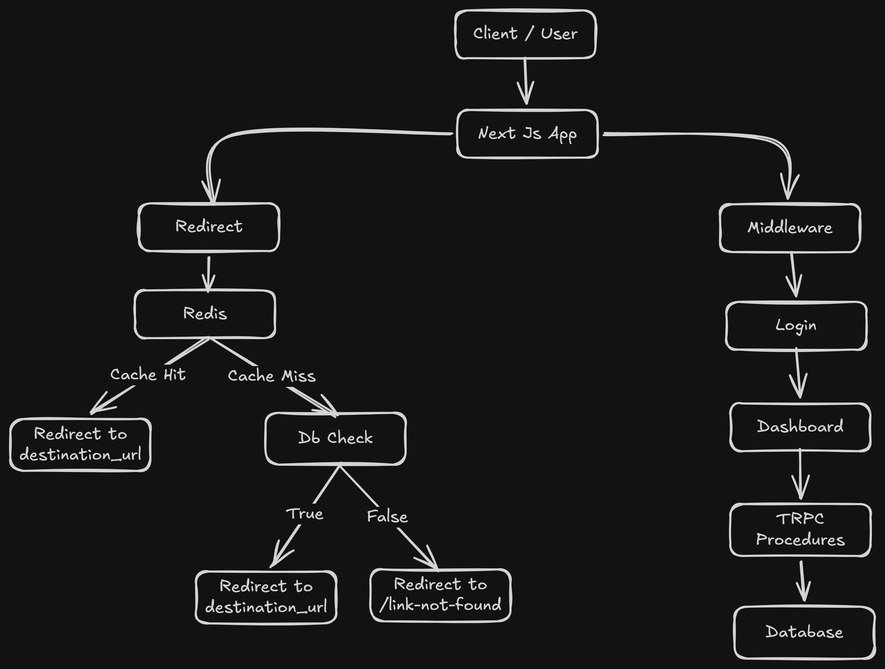

# TinyTags

> Because nobody should have to send a URL that looks like a stack trace.

I started this project thinking: "How hard can a URL shortener be?" - The universe disagreed.

A few weekends later I somehow found myself debugging:

* OAuth callback URLs
* Cookie synchronization between the browser and server
* Anonymous account upgrades
* Row Level Security (RLS) policies
* Redis cache invalidation
* Middleware authorization
* End-to-end type-safe APIs with tRPC

Turns out shortening URLs was easy. Building everything around it was where the real fun started.

---

## Features

### Link Management

* Create short URLs
* Custom slugs
* Edit destination URLs
* Delete links
* QR Code Generation

### Authentication

* Google OAuth
* Anonymous Login
* Anonymous → Google Account Upgrade
* Cookie-based SSR Authentication
* Protected Routes
* Protected APIs

### Analytics

* Per-link click tracking
* Click counter updates on redirects

### Performance

* Redis redirect caching
* Fast redirect resolution
* Database read reduction

### Security

* Supabase SSR Authentication
* Route Protection Middleware
* tRPC Protected Procedures
* Row Level Security (RLS)
* Ownership-Based Authorization

---

# Architecture Overview

TinyTags follows a serverless-first architecture.



---

# Authentication & Authorization

TinyTags separates authentication from authorization.

Authentication is handled by Supabase Auth.

Authorization is enforced through:

* Middleware
* tRPC Protected Procedures
* Row Level Security (RLS)

Every link belongs to a user.

A user can only access their own links.

For detailed auth flows, PKCE, anonymous users, account linking and RLS policies:

📚 See `/docs/authentication.md`

---

## API Documentation

TinyTags exposes a fully documented tRPC API.

View the interactive API documentation:

```text
https://ttags.vercel.app/docs
https://tiny-tag.vercel.app/docs
```

Base URL:

```text
https://ttags.vercel.app/docs
https://tiny-tag.vercel.app/api/trpc
```

# Project Structure

```txt
apps/
└── web/
    ├── src/
    │   ├── app/
    │   │   ├── (public)/
    │   │   ├── (auth)/
    │   │   ├── (app)/
    │   │   ├── auth/
    │   │   └── s/
    │   │
    │   ├── components/
    │   │
    │   ├── features/
    │   │   ├── links/
    │   │   ├── dashboard/
    │   │   └── analytics/
    │   │
    │   ├── hooks/
    │   ├── trpc/
    │   ├── utils/
    │   └── middleware/
    │
    └── public/

packages/
├── db/
├── cache/
├── shared/
├── ui/
└── types/

docs/
├── authentication.md
├── architecture.png

```

---

# Tech Stack

| Category         | Technology           |
| ---------------- | -------------------- |
| Frontend         | Next.js 15           |
| Language         | TypeScript           |
| API Layer        | tRPC                 |
| Authentication   | Supabase Auth        |
| Database         | Supabase Postgres    |
| Authorization    | RLS                  |
| Cache            | Upstash Redis        |
| State Management | React Query          |
| Hosting          | Vercel               |
| Runtime          | Serverless Functions |

---

# Local Development

Clone the repository:

```bash
git clone https://github.com/Sujith-Srikar/tinytags.git

cd tinytags
```

Install dependencies:

```bash
pnpm install
```

Create environment files:

```bash
cp .env.example .env
```

Start development:

```bash
pnpm dev
```

---

# Documentation

Detailed architecture and design decisions live in the `/docs` folder.

| Document           | Description                 |
| ------------------ | --------------------------- |
| authentication.md  | Auth, OAuth, SSR, RLS       |

---

# Future Improvements

* Custom domains
* QR code Customization
* Advanced analytics
* Link Expiration
* Password Protection
* Link tags and folders
* Bulk import/export

---

## Small README Easter Egg

I would add this at the very bottom:

```md

There are only two hard things in Computer Science:

- Cache invalidation
- Naming things
- Off-by-one errors
```
---

## Contributing

Feel free to submit issues and enhancement requests!

---

## License

This project is open source and available under the MIT License.


-----------

```
├── apps/
│   └── web/
│       ├── app/
│       │   ├── (app)/
│       │   │   ├── analytics/
│       │   │   │   └── page.tsx
│       │   │   ├── dashboard/
│       │   │   │   ├── page.module.scss
│       │   │   │   └── page.tsx
│       │   │   ├── links/
│       │   │   │   └── [id]/
│       │   │   │       ├── page.module.scss
│       │   │   │       └── page.tsx
│       │   │   ├── settings/
│       │   │   │   └── page.tsx
│       │   │   ├── layout.module.scss
│       │   │   └── layout.tsx
│       │   ├── (auth)/
│       │   │   └── auth/
│       │   │       ├── callback/
│       │   │       │   └── route.ts
│       │   │       └── login/
│       │   │           ├── page.module.scss
│       │   │           └── page.tsx
│       │   ├── (public)/
│       │   │   ├── health/
│       │   │   │   └── route.ts
│       │   │   ├── link-unavailable/
│       │   │   │   └── page.tsx
│       │   │   ├── password/
│       │   │   │   └── [slug]/
│       │   │   │       └── page.tsx
│       │   │   ├── page.module.css
│       │   │   └── page.tsx
│       │   ├── [slug]/
│       │   │   └── route.ts
│       │   ├── api/
│       │   │   └── trpc/
│       │   │       └── [trpc]/
│       │   │           └── route.ts
│       │   ├── docs/
│       │   │   └── route.ts
│       │   ├── styles/
│       │   │   └── landing.scss
│       │   ├── globals.scss
│       │   ├── layout.tsx
│       │   └── not-found.tsx
│       ├── components/
│       │   ├── Landing/
│       │   │   ├── Hero/
│       │   │   │   ├── Hero.module.scss
│       │   │   │   └── Hero.tsx
│       │   │   ├── UrlCompression/
│       │   │   │   ├── UrlCompression.module.scss
│       │   │   │   └── UrlCompression.tsx
│       │   │   └── index.ts
│       │   ├── Layout/
│       │   │   ├── ComingSoon/
│       │   │   │   ├── ComingSoon.module.scss
│       │   │   │   └── ComingSoon.tsx
│       │   │   ├── NotFound/
│       │   │   │   ├── Model.tsx
│       │   │   │   ├── NotFoundPage.tsx
│       │   │   │   └── Scene.tsx
│       │   │   ├── Sidebar/
│       │   │   │   ├── Sidebar.module.scss
│       │   │   │   └── Sidebar.tsx
│       │   │   ├── TopBar/
│       │   │   │   ├── TopBar.module.scss
│       │   │   │   └── TopBar.tsx
│       │   │   └── index.ts
│       │   └── UI/
│       │       ├── Logo/
│       │       │   ├── Logo.module.scss
│       │       │   └── Logo.tsx
│       │       ├── Modal/
│       │       │   ├── DeleteConfirmModal.module.scss
│       │       │   ├── DeleteConfirmModal.tsx
│       │       │   ├── Modal.module.scss
│       │       │   ├── Modal.tsx
│       │       │   ├── ModalParts.module.scss
│       │       │   └── ModalParts.tsx
│       │       ├── ThemeToggle/
│       │       │   ├── ThemeToggle.module.scss
│       │       │   └── ThemeToggle.tsx
│       │       └── index.ts
│       ├── features/
│       │   └── components/
│       │       ├── dashboard/
│       │       │   ├── LinkCard/
│       │       │   │   ├── page.module.scss
│       │       │   │   └── page.tsx
│       │       │   ├── LinkList/
│       │       │   │   ├── page.module.scss
│       │       │   │   └── page.tsx
│       │       │   ├── StatsBar/
│       │       │   │   ├── page.module.scss
│       │       │   │   └── page.tsx
│       │       │   └── index.ts
│       │       └── links/
│       │           ├── sections/
│       │           │   ├── CommentSection.tsx
│       │           │   ├── DestinationSection.tsx
│       │           │   ├── ExpirySection.tsx
│       │           │   ├── index.ts
│       │           │   ├── PasswordModal.tsx
│       │           │   ├── PasswordSection.tsx
│       │           │   ├── QrCodeSection.tsx
│       │           │   └── ShortLinksSection.tsx
│       │           ├── LinkBuilder.module.scss
│       │           └── LinkBuilder.tsx
│       ├── hooks/
│       │   ├── useAuthErrors.ts
│       │   ├── useBreakPoint.ts
│       │   ├── useLinkBuilder.ts
│       │   └── useSlugGenerator.ts
│       ├── providers/
│       │   ├── Providers.tsx
│       │   ├── ThemeProvider.tsx
│       │   └── TRPCProvider.tsx
│       ├── public/
│       │   ├── fonts/
│       │   │   ├── PPNeueMontreal-Regular.ttf
│       │   │   └── Satoshi-Variable.ttf
│       │   └── media/
│       │       └── shards.glb
│       ├── trpc/
│       │   ├── router/
│       │   │   ├── app.ts
│       │   │   ├── get.ts
│       │   │   └── post.ts
│       │   ├── client.ts
│       │   ├── context.ts
│       │   └── init.ts
│       ├── utils/
│       │   ├── auth/
│       │   │   ├── client.ts
│       │   │   └── server.ts
│       │   ├── formatters.ts
│       │   └── generate-slug.ts
│       ├── .gitignore
│       ├── components.json
│       ├── eslint.config.js
│       ├── next.config.js
│       ├── package.json
│       ├── postcss.config.mjs
│       ├── proxy.ts
│       ├── README.md
│       └── tsconfig.json
├── docs/
│   ├── architecture.png
│   ├── Auth.md
│   ├── Design.md
│   └── PRODUCT.md
├── packages/
│   ├── cache/
│   │   ├── src/
│   │   │   ├── client.ts
│   │   │   ├── index.ts
│   │   │   ├── schema.ts
│   │   │   └── service.ts
│   │   ├── package.json
│   │   └── tsconfig.json
│   ├── db/
│   │   ├── src/
│   │   │   ├── queries/
│   │   │   │   ├── index.ts
│   │   │   │   ├── protected.queries.ts
│   │   │   │   └── public.queries.ts
│   │   │   ├── client.ts
│   │   │   ├── index.ts
│   │   │   └── types.ts
│   │   ├── supabase/
│   │   │   ├── migrations/
│   │   │   │   ├── 20260516170122_create_links_table.sql
│   │   │   │   ├── 20260531034846_rename-link-columns.sql
│   │   │   │   ├── 20260531042533_rename-description-to-comments.sql
│   │   │   │   ├── 20260531052151_add-isActive-column.sql
│   │   │   │   ├── 20260618012541_add user_id.sql
│   │   │   │   ├── 20260618014633_add index for user_id.sql
│   │   │   │   ├── 20260619015256_add-rls-policies.sql
│   │   │   │   ├── 20260621050438_make_user_id_not_null.sql
│   │   │   │   ├── 20260630124055_create-health-rpc.sql
│   │   │   │   ├── 20260713100920_extend_the_exisitng_get_redirect_url_rpc.sql
│   │   │   │   ├── 20260725070232_increment_click_count-rls.sql
│   │   │   │   └── 20260725072116_increment_count_rls_making_public.sql
│   │   │   └── config.toml
│   │   ├── package.json
│   │   └── tsconfig.json
│   ├── eslint-config/
│   │   ├── base.js
│   │   ├── next.js
│   │   ├── package.json
│   │   ├── react-internal.js
│   │   └── README.md
│   ├── shared/
│   │   ├── src/
│   │   │   ├── env/
│   │   │   │   ├── client.ts
│   │   │   │   └── server.ts
│   │   │   ├── types/
│   │   │   │   ├── common.ts
│   │   │   │   └── web.ts
│   │   │   ├── constant.ts
│   │   │   ├── index.ts
│   │   │   ├── logger.ts
│   │   │   └── performance.ts
│   │   ├── package.json
│   │   └── tsconfig.json
│   ├── typescript-config/
│   │   ├── base.json
│   │   ├── nextjs.json
│   │   ├── package.json
│   │   └── react-library.json
│   └── ui/
│       ├── src/
│       │   ├── components/
│       │   │   ├── animated-container.tsx
│       │   │   ├── animated-list.tsx
│       │   │   ├── animated-select.tsx
│       │   │   ├── animated-tabs.tsx
│       │   │   ├── badge.tsx
│       │   │   ├── button.tsx
│       │   │   ├── calendar.tsx
│       │   │   ├── copybutton.tsx
│       │   │   ├── date-time.tsx
│       │   │   ├── dialog-stack.tsx
│       │   │   ├── field.tsx
│       │   │   ├── infotooltip.tsx
│       │   │   ├── input.tsx
│       │   │   ├── label.tsx
│       │   │   ├── modal.tsx
│       │   │   ├── popover.tsx
│       │   │   ├── separator.tsx
│       │   │   ├── text-particle.tsx
│       │   │   ├── textarea.tsx
│       │   │   ├── time.tsx
│       │   │   ├── tooltip.tsx
│       │   │   └── url-compression.tsx
│       │   ├── lib/
│       │   │   ├── expiry.ts
│       │   │   ├── time-picker-utils.ts
│       │   │   └── utils.ts
│       │   └── index.ts
│       ├── eslint.config.mjs
│       ├── package.json
│       └── tsconfig.json
├── .dockerignore
├── .env.example
├── .gitignore
├── .npmrc
├── AGENTS.md
├── docker-compose.yaml
├── Dockerfile
├── package.json
├── pnpm-lock.yaml
├── pnpm-workspace.yaml
├── README.md
├── turbo.json
└── vercel.json


```